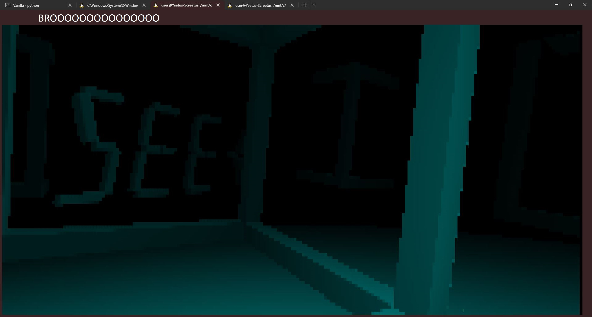

# Cubeland

**Author**: JuliaPoo

**Category**: RE

Flag: `SEE{CR4ZY-WITH-CUBES}`

## Description

```
bro1: yo bro
bro2: whatsup bro
bro1: bro am playing this _console_ game bro is so cool bro
bro2: damn bro
bro1: this game bro, is so full of cubes bro
bro2: broooooo
bro1: broooooo
bro1: OH SHIT BRO
bro2: WHAT BRO?
bro1: THERES SOMETHING THAT AINT CUBES HERE BRO
bro2: BROOOOOO
bro1: BROOOOOO
```



## Difficulty

Medium

## Solution

1. Reverse the strings to know where the player coordinates are
2. Reverse the functions that display the screen + fill the pixel buffer to know that there is a function that computes the colours per-pixel
3. Reverse the first few lines of the function to know which variables reference the player's position
4. Notice that there is a loop over an array of 21 numbers, and that loop won't be executed unless the player's position is within a bounding box
5. Substitute the coordinates of the bounding box into the player's coordinates to render the flag.
