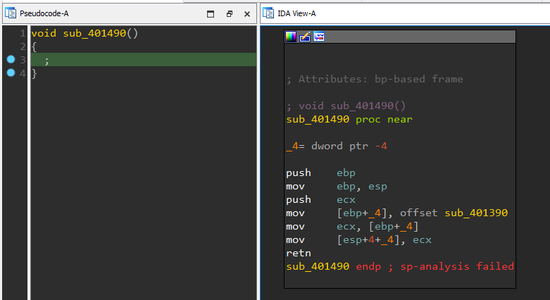

# Sleight of Hand

**Author**: goatmilkkk

**Category**: RE

Flag: `SEE{y0u_saw_thr0ugh_mY_tr1ck!}`

## Description

Yet another flag encryptor, but this time with an embedded magic trick :)

Encrypted Flag: `fde5f5e12640b9860f526a9601861e752e84d866825c415549f454fe8ba3`

The password for the ZIP file is `infected`. While the binary will not harm your system, I suggest analyzing everything in a Virtual Machine with antiviruses switched off.
## Difficulty

Medium

## Deployment

NA

## Solution

<u>Custom RC4</u>
The final step of the custom RC4 uses the following implementation:

```python
ciphertext[n] = (plaintext[n] + magic[n] - keys[n]) % 256;
```

To reverse this, we do the following:

```python
plaintext[n] = (ciphertext[n] - magic[n] + keys[n]) % 256;
```

<u>Anti-Decompilation</u>
The binary leverages on a technique known as [Return Hijacking](https://blog.ret2.io/2017/11/16/dangers-of-the-decompiler/) to hide code. Viewing `sub_401490` in pseudocode view shows nothing since it's a void function. However, looking at the disassembly reveals that a function address was returned, essentially calling the function.



TLDR, this function substitutes the magic constants that the custom rc4 uses at runtime before encrypting the flag.

