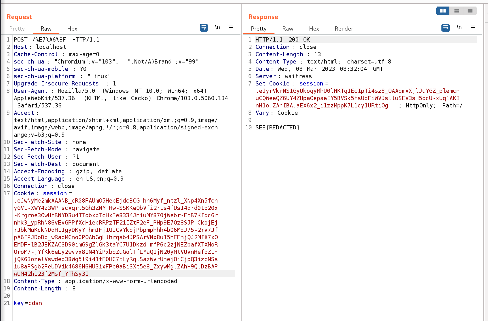

# 福

**Author**: jeyas

**Category**: Web

Flag: `SEE{H0w_f0rtun4T3_Y3t_An0theR__FL4sk_UnSigN_}`

## Description
```
░░░░█▐▄▒▒▒▌▌▒▒▌░▌▒▐▐▐▒▒▐▒▒▌▒▀▄▀▄░
░░░█▐▒▒▀▀▌░▀▀▀░░▀▀▀░░▀▀▄▌▌▐▒▒▒▌▐░
░░▐▒▒▀▀▄▐░▀▀▄▄░░░░░░░░░░░▐▒▌▒▒▐░▌            福福福福!
░░▐▒▌▒▒▒▌░▄▄▄▄█▄░░░░░░░▄▄▄▐▐▄▄▀░░
░░▌▐▒▒▒▐░░░░░░░░░░░░░▀█▄░░░░▌▌░░░
▄▀▒▒▌▒▒▐░░░░░░░▄░░▄░░░░░▀▀░░▌▌░░░
▄▄▀▒▐▒▒▐░░░░░░░▐▀▀▀▄▄▀░░░░░░▌▌░░░
░░░░█▌▒▒▌░░░░░▐▒▒▒▒▒▌░░░░░░▐▐▒▀▀▄
░░▄▀▒▒▒▒▐░░░░░▐▒▒▒▒▐░░░░░▄█▄▒▐▒▒▒
▄▀▒▒▒▒▒▄██▀▄▄░░▀▄▄▀░░▄▄▀█▄░█▀▒▒▒▒
```
## Difficulty

Easy

## Deployment

`docker build -t fortune`

`docker run -d -p 80:80 fortune:fortune`

## Solution

The flag is stored as a variable with the 福 (fú) character, which has a charcode of [31119](https://gchq.github.io/CyberChef/#recipe=To_Charcode('Space',10)&input=56aP). 

We'll be looking to set `result` to 31119 so `return eval(chr(result))` prints the flag.

```python
with open('flag.txt') as flag:
	contents = flag.read()
	福 = contents.strip()

#------------> Snip!

	if result is not None:
		return eval(chr(result))
	else:
		return 'Bad Luck.'

```
The /福 endpoint only accepts POST requests and a single `key` parameter. This is then set to `app.config['SECRET_KEY']`, which is what flask uses to [sign session cookies](https://flask.palletsprojects.com/en/2.2.x/config/#SECRET_KEY).

While the `app.config['SECRET_KEY']` is not necessary for *decoding* session keys. The secret used to sign session cookies must equal `app.config['SECRET_KEY']` for it to be considered as the `session` object. 

```python
keys = []

#------------> Snip!

@app.route('/福', methods=['POST'])
def fortold():
	keys.clear()
	start = request.form.get('key')
	app.config['SECRET_KEY'] = start
	replace_secret_key()

	value = [secret(key) for key in keys]
	result = solve(*value)

	if result is not None:
		return eval(chr(result))
	else:
		return 'Bad Luck.'
```

### Just leak the SECRET_KEY... oh wait.

Essentially, the `replace_secret_key()` function is a recursive function that stores the `session['key']` attribute and updates itself with the `sesssion['session']` attribute. It does so until the `session['key']` attribute is in the `keys` array and has the `session['end']` attribute.

```python
def replace_secret_key():
	if 'key' in session and session['key'] not in keys:
		keys.append(session['key'])
		app.config["SECRET_KEY"] = session['key']
	if 'session' in session and 'end' not in session:
		new_session = session['session']
		session.update(decrypt_cookie(new_session))
		replace_secret_key()
```

### Wait... secret?

Next, the values of `key` are passed to the `secret()` function. These values are used to set the `random.seed` and generate a random integer from 8 to 88888 (inclusive). These values are then passed to the `solve()` function

```python
def secret(key):
	random.seed(key)
	return random.randint(8, 88888)
```

### solve()-ing the challenge

The `solve()` function uses [z3](https://pypi.org/project/z3-solver/) to check if the 5 values:

$$ a,b,c,d,f $$ 

pass to the `solve()` function satisfy the equation:

$$ 8 \le a,b,c,d,e,f \le 88888, \quad a,b,c,d,e,f \in \mathbb{Z}^+ $$

$$ (a^3) \cdot (b^2 + c^2) \cdot (2d + 1) = e^3 + f^3 $$

As e is returned by the function, this implies that:

$$ e = 31119,  e < f $$
> z3 will "assign" the lower values to the variables on the left and higher values to the variables on the right.

> Remember that `secret()` can only generate values between 8 and 88888, so those are the bounds.

```python
def solve(a_value, b_value, c_value, d_value, f_value):
	# Create the variables
	a, b, c, d, e, f = Ints('a b c d e f')

	# Set the relationships between the variables
	constraints = [And(8 <= v) for v in [a, b, c, d, e, f]]
	constraints += [a == a_value] 
	constraints += [b == b_value]
	constraints += [c == c_value]
	constraints += [d == d_value]
	constraints += [f == f_value]
	constraints += [(a ** 3) * (b**2 + c**2) * (2*d + 1) == (e**3) + (f**3)]

	# Find a satisfying solution
	s = Solver()
	s.add(constraints)
	if s.check() == sat:
		m = s.model()
		return int(m[e].as_long())
	else:
		return None
```

There are many solutions to this problem( the simplest using [prime factorization](https://www.wolframalpha.com/input?i=solve+%2841%5E3%29%28b%5E2%2Bc%5E2%29%282d%2B1%29++%3D++%282%29%2831119%5E3%29+over+the+integers+)). For the purposes of this solution, I will be using 

$$ f = 88888 $$

which yields 

$$ a = 41, b = 1728, c = 803, d = 1463 $$

> What an auspicious value! 😊🧧 

### Tying it all together

First I'll use itertools to find valid seeds that generate the correct math variables.
[Link to PoC](https://github.com/Social-Engineering-Experts/SEETF-2023-Internal/blob/main/challs/web/%E7%A6%8F/solve/randomer.py)
```
cdsn:41
aqoi:1728
ewmu:803
aucl:1463
bphi:88888
```
Next I'll use flask-unsign to recursively sign a flask session key.
[Link to PoC](https://github.com/Social-Engineering-Experts/SEETF-2023-Internal/blob/main/challs/web/%E7%A6%8F/solve/solve.py)
```
session=..eJwNyMm2Y0AAANB_ybqTgyihd4aImTLEsHFiFlJieBR9-t-77_L-OXXlfvp9yosZnX6d5nKe2wH9j0upbdY-f7zhzfO8JaS0j19iq-HsIyt9F8NG3oZej5JGEEys3wB3RtOYVlJRRnpaPndHynKFZoJG8t8sLimQ9GDkftYCzg1n-_Nd5-RRjQp--WZXt96mCPekqdXeS26BHHwOWcvMRq1qh-yitGqQJBllbx62HGbLUTf8ROsB_8JT0hWkqJ09S4EkKH7YdZQY1W1oSZuIIXC1wbS-thAyRnXUZ1Az2Wfksatgk-J6euY70upYtnKrgAKEUzth3COyCeiJVQri-c2qZ-QBd146ynK7A3N-SUhVQtvoGmKlCSo2oaAhoBegNucr2PU7aJ7bvrVmvlZGl8CHuakKYhVpBGZsjizeBbDnut2I7Xio7M-IojmDbbzeCPYaQSgeTKvpxhU4X43zcAz8IATqilY7nwz6iiKIES2LvhSOItMSO6qXlPKzc5YJQ3zzpFKGD0eMQdy_i11avDxNzzy1Z61WX5IHWih4me_kLXq7i3Z3o9HlOuNz56DSGm0cnP7-A0pxscY.ZGnt2g.RY55GzqMIeq7-_wXVFAnVS4gYwg
```

Finally, I can send a POST request to /福 with my cookie!

